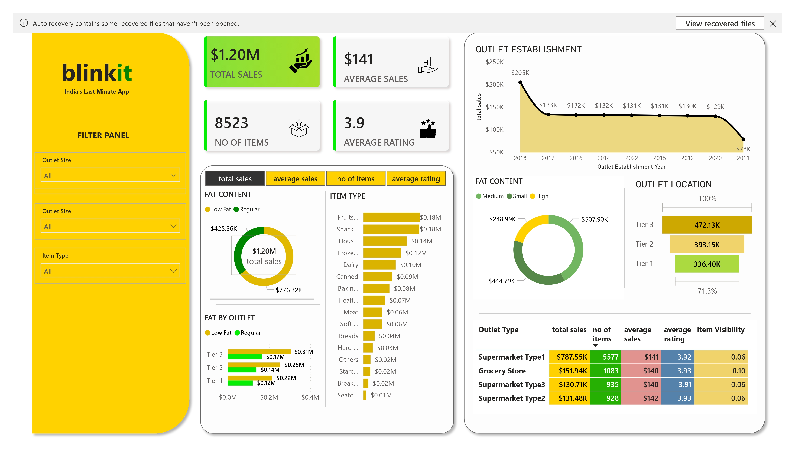

# Blinkit Visualization  using Power BI

Power BI dashboard analyzing Blinkit's sales, customer satisfaction, and inventory using KPIs like total sales, average sales, items sold, and average customer rationing.

## 📌 Overview
The analysis includes:
Total sales - overall revenue generated from all items sold
Average sales - average revenue  per sale
No of items - count of total items sold
Average rationing - the average customer rationing for items sold.

## 🗃️ Dataset
The data for this project is sourced from Kaggle:
[Blinkit Sales Dataset](https://www.kaggle.com/datasets/akxiit/blinkit-sales-dataset)
